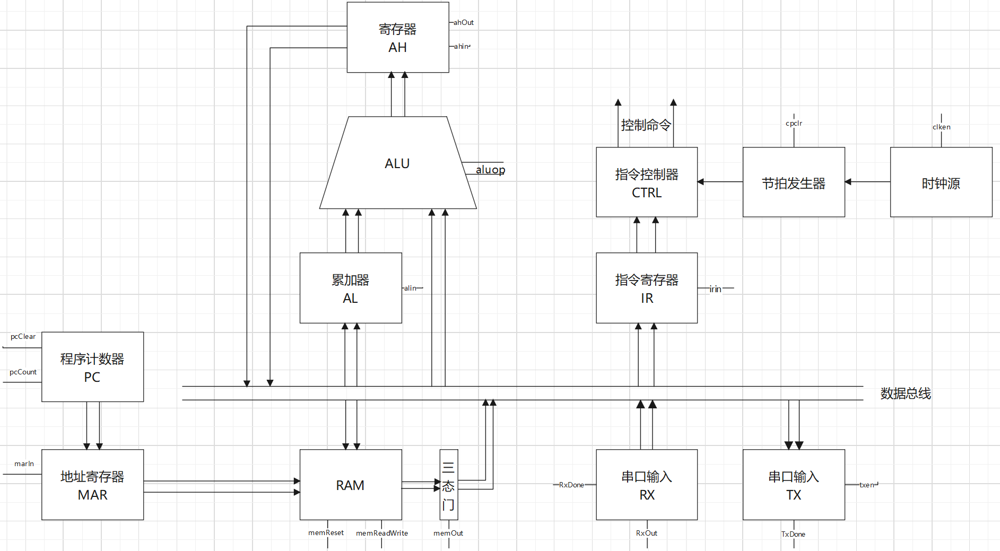
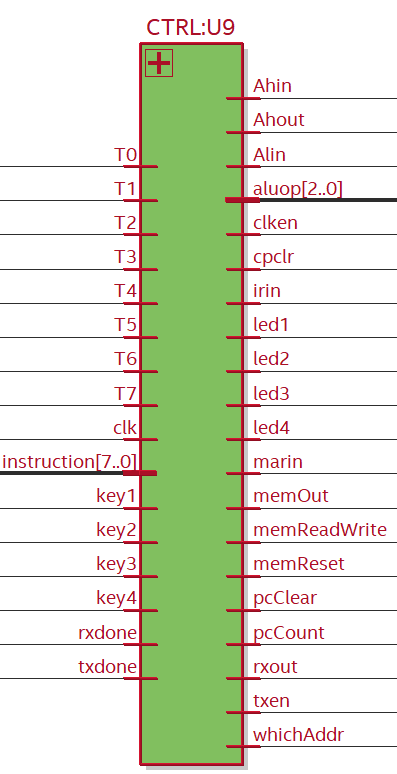

# 8位模型计算机

数字逻辑与数字系统课设,基于EP4CE6E22C8的VHDL实现的8位模型计算机,支持12条指令,通过串口输入输出,可编程.

通过串口接收数据与指令,执行后,可将结果(即内存中内容)通过串口输出,因此我称之为可编程.

使用 睿智FPGA EP4CE6E22C8 开发板 , 配置管脚图如下,其余管脚是为了Signal Tap,配置虚拟管脚即可.


RTL见`asserts/RTL.pdf` 

结构框图

## 输入/输出

数码管最高位显示地址的个位,其余三位显示累加器AL输出.

通过串口输入输出,FPGA开发板的系统时钟为50MHZ,波特率设置为9600,数据位8,停止位1,检验位None,流程控制None.

##  指令

| 指令码   | 指令    | 内容                                  |
| -------- | ------- | ------------------------------------- |
| 11110000 | NOT_AX  | 对AX逻辑非，结果存入AX                |
| 11110001 | AND     | 立即数与AX逻辑与，结果存入AX          |
| 11110010 | OR      | 立即数与AX逻辑或，结果存入AX          |
| 11110011 | XOR     | 立即数与AX逻辑异或，结果存入AX        |
| 11110100 | SHL_AX  | AX逻辑左移一位，结果存入AX            |
| 11110101 | SHR_AX  | AX逻辑右移一位，结果存入AX            |
| 11110110 | ADD     | 立即数与AX算数加，结果存入AX          |
| 11110111 | SUB     | 立即数与AX算数减，结果存入AX          |
| 11111000 | LOAD_AX | 将立即数存入AX                        |
| 11111001 | STORE   | 将ALU结果存入内存(该指令的下一个地址) |
| 11111010 | LOOP    | 从0地址重新运行指令                   |
| 11111011 | HALT    | 停机                                  |


## 按键

| 按键  | 说明                                                         |
| ----- | ------------------------------------------------------------ |
| key1  | LED1亮,为接收串口数据状态,会从串口接收数据存到RAM中,每接收一个字节,地址自增一 |
| key2  | LED2亮,为串口发送状态,会通过串口从当前地址开始发送23个字节(我的串口调试工具一行显示23个字节). |
| key3  | LED3亮,将地址清零.                                           |
| key4  | LED4亮,从当前地址开始执行指令.                               |
| reset | RAM清零                                                      |


## 指令示例 

```
F0   not  
F1   and
F2   or
F3   xor
F4   shl
F5   shr
F6   add
F7   sub
F8   load a 
F9   store a
FA   LOOP FROM 0
FB   halt
Ohters halt

示例:

F8 02 F5 F9 00 F6 04 F9 00 F7 03 F9 00
LOAD 02;SHR;STORE;ADD 04;STORE;SUB 03;STORE

F8 E2 F3 18 F9 00 F4 F2 03 F9 00
LOAD E2;XOR 18;STORE;SHL;OR 03;STORE

F8 02 F4 F6 04 F9 00 FA
LOAD 02;SHL;ADD 04;STORE;LOOP FROM [0]

BUG:
F8 02 F1 02 F9 00     //F1 后 F9 ,结果不会保存到RAM
```

## 指令控制器

| 端口         | 说明                  |
| ------------ | --------------------- |
| T0-T9        | 节拍输入              |
| clk          | 时钟输入              |
| instruction  | 指令输入              |
| key1-key4    | 按键输入              |
| rxdone       | 串口接受完成          |
| txdone       | 串口发送完成          |
| Ahin         | ALU结果寄存器输入控制 |
| Ahout        | ALU结果寄存器输出控制 |
| aluop        | ALU运算指令           |
| clken        | 时钟源使能            |
| cpclr        | 节拍器重置使能        |
| irin         | 指令寄存器输入        |
| led1-led4    | led灯                 |
| marin        | 地址寄存器输入        |
| memOut       | 三态门输出使能        |
| memReadWrite | 内存读/写控制         |
| memReset     | 内存清零              |
| pcClear      | 程序计数器重置使能    |
| pcCount      | 程序计数器计数使能    |
| rxout        | 串口输入模块输入使能  |
| txen         | 串口输出模块使能      |





## 文件说明

```
│  74283.vhd		加法器
│  8trigate.vhd		8位三态门
│  accumulator.vhd	累加器,实质上就是个寄存器
│  alu.vhd		ALU
│  clockPulse.vhd	节拍器,产生8个节拍
│  clockSource.vhd	时钟源
│  computer.vhd		顶层文件
│  control.vhd		指令控制器,写的很复杂,其实应该用逻辑门的组合更简洁.
│  dataRegister.vhd	实质为一个寄存器+一个三态门
│  D_flip_flop.vhd	D触发器
│  hex_to_7_seg.vhd	数码管显示
│  keyFitting.vhd	按键消抖
│  led.vhd		数码管显示
│  MAR.vhd		地址寄存器,为了既能从计数器也能总线,获得地址,但本模型机并没有用上
│  memory.vhd		RAM内存
│  my74151.vhd		数据选择器
│  numtoled.vhd		数码管显示
│  paralleladder8.vhd	加法器
│  programmeCounter.vhd	地址计数器
│  rs232rx.vhd		串口RX
│  rs232tx.vhd		串口TX
│  shiftl.vhd		左移
│  shiftr.vhd		右移
│  subtract.vhd		减,实为加补码
│  testtop.vhd		测试用的顶层文件
│  tri_gate.vhd		三态门
│  UART_RX.vhd		
│  UART_TX.vhd
```


## 其他

` echo -n $学号 | sha512sum = 6403c4eb8da69dc44dff1e006b7bf3a9adf8e25bb9699b31414b16ebff45ef1df85593d239b4a74fdd47f9255264f6112e0f72d8d0125da773dfef17ef07de94`

如果有帮助,请Star,谢谢.
